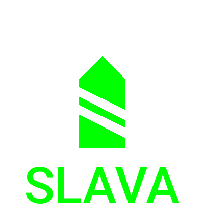

# SHIP ICON GENERATOR
- タク作るときの船のアイコンを生成するやつ

## Required
- Pillow
  - `pip3 install Pillow`
- Roboto-Medium

## Usage
- `./shipicon.py --shiplist=<shiplist> --shipclass=(submarine|destroyer|cruiser|battleship)`
- デフォルトでは`icons/<shipclass>/<ally|enemy>`にそれぞれの名前の船のアイコンを生成する。
- T10と11の艦名リスト`(cv|bb|ca|dd|ss)_list.txt`が付属している。
  - `./generate`で、それを使って自動生成してくれる。

## LICENSE
- 以下のガイドラインに基づく
  - 日本語: https://worldofwarships.asia/ja/news/general-news/content-creator-guidelines/
  - English: https://worldofwarships.asia/en/news/general-news/content-creator-guidelines/

## Author
- void-hoge (Discord: void-hoge#5115, Twitter: @voidhoge)
